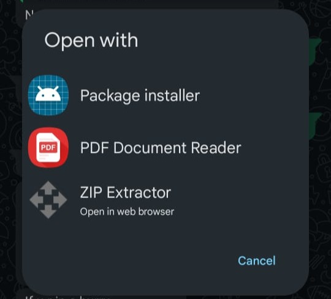

# Palmingo | Sri Lankan Sign Language Gaming Application

Palmingo is an interactive mobile game built with Unity, designed to make learning Sri Lankan Sign Language (SSL) fun and engaging! 🎮

🚀 Features

🎯 Challenge Mode

- Play through three exciting games that test your signing skills. Earn coins and diamonds as you complete challenges!

📚 Learning Mode
- Progress through moving levels that gradually increase in difficulty. 
- Interactive dashboards to track learning. 
- A progress view to see achievements and mastered signs.

🏆 Rewards & Progress
- Collect coins and diamonds as you advance!
- Unlock new levels and content with your rewards.

---------------------------------------------------

# 📲 Get Started | How to download Palmingo
---------------------------------------------------

Step 01 - Click the following link

https://drive.google.com/file/d/1paHky0RabENoxlCRbz4AqjzCNmq_T8Zu/view

## Select Package Installer

## The .apk file will start running now

## If there are any permissions required, allow it

## If you have already downloaded the app, you can update it

## App will install in your device

